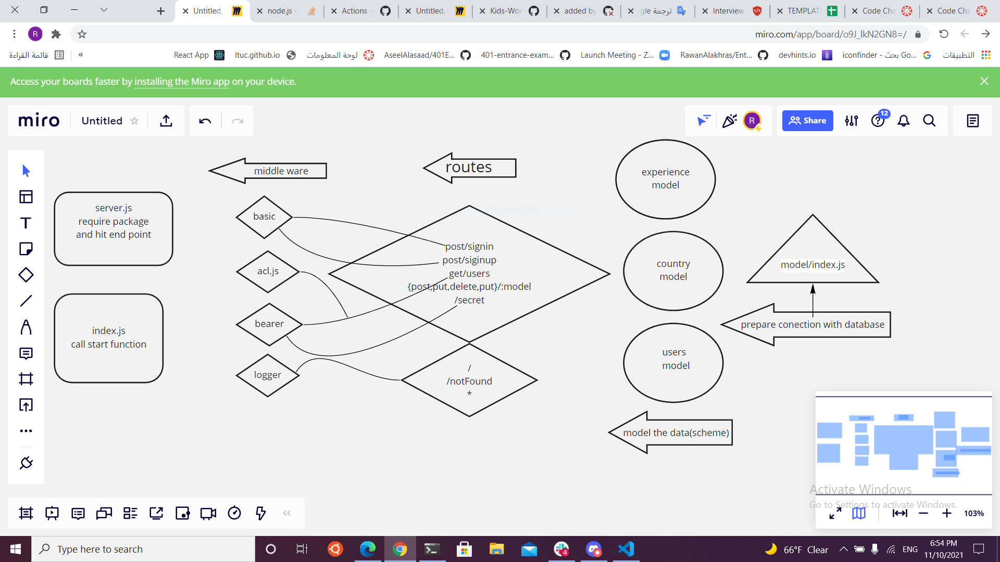
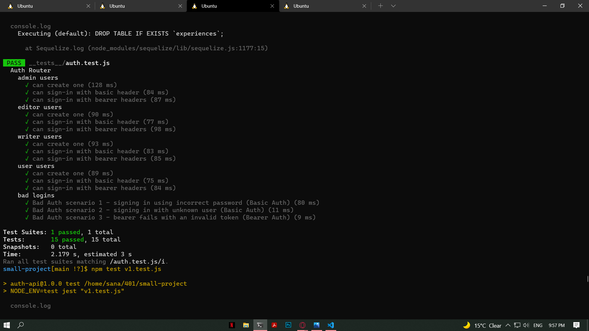
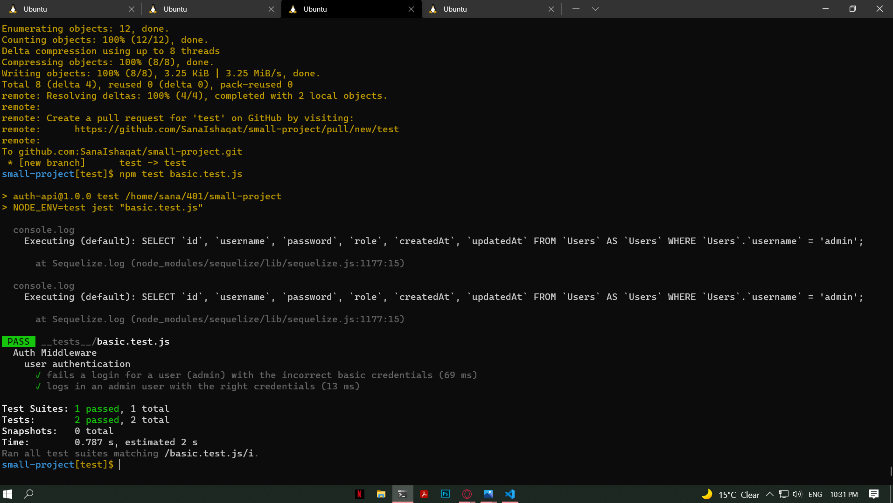
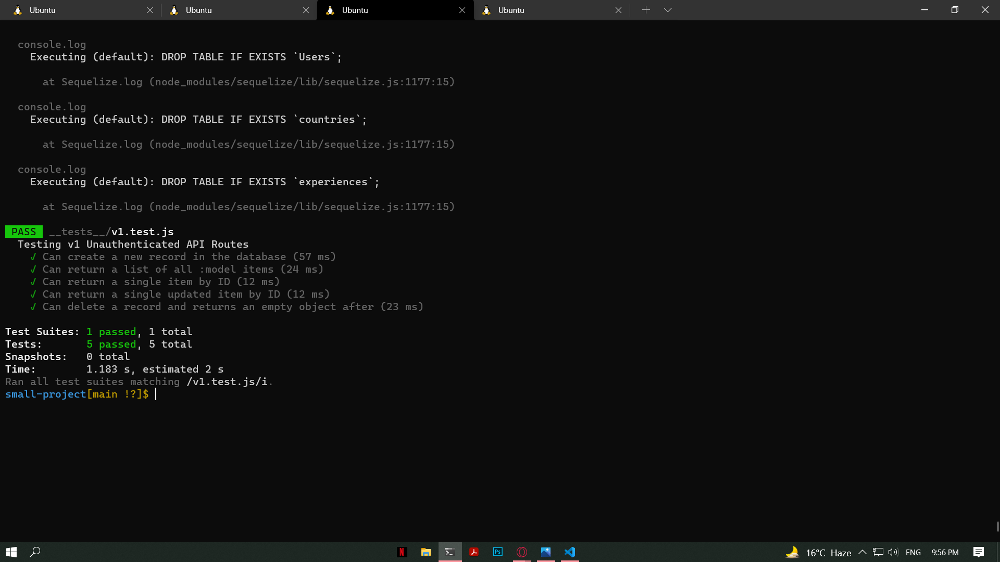
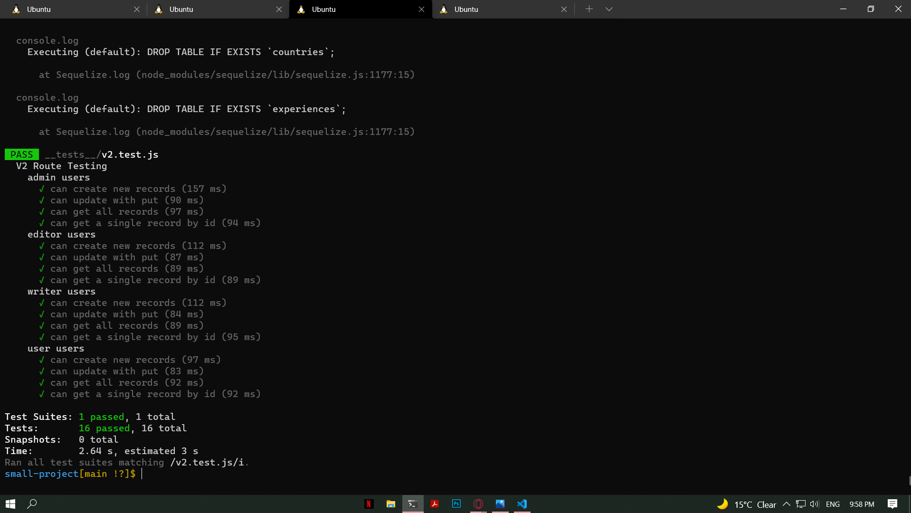

# small-project

### project members

1-**raneem abu jamous** 
2-**sana ishaqat** 
3-**mahmoud hamdan** 
4-**mu'nes** 

## Heroku:

https://small-project-401.herokuapp.com/

### Heroku/experience

https://small-project-401.herokuapp.com/api/v1/experience

### Heroku/country

https://small-project-401.herokuapp.com/api/v1/country

## Github Actions:

https://github.com/small-project401/small-project/actions

## pull request :

https://github.com/small-project401/small-project/pull/8

## .env

- PORT - Your Port Number
- DATABASE_URL=postgres://localhost:5432/yourDataBaseName
- SECRET= AnySecretWordYouChoose

## Tests

### Auth Tests

### Basic Tests

### V1 Tests

### V2 Tests

### Users Model
{
    "username":"sana",
    "password":"sana",
    "role":"admin"
}

### Country Model

 {
     "countryName": "Italy",
    "cityName":"Rome",
    "language":"Italian"
     
 }

 ### Experience Model 
{

"touristName": "sana",
    "favFood": "pizza",
    "favLandmark": "colosseum",
    "thoughts": "Had wonderful time walking down the streets and alley of rome, seeing all kinds of ancient history landmark in each corner, loved the people and the food, avoid visiting during holidays to avoid crowds of tourists"

}

